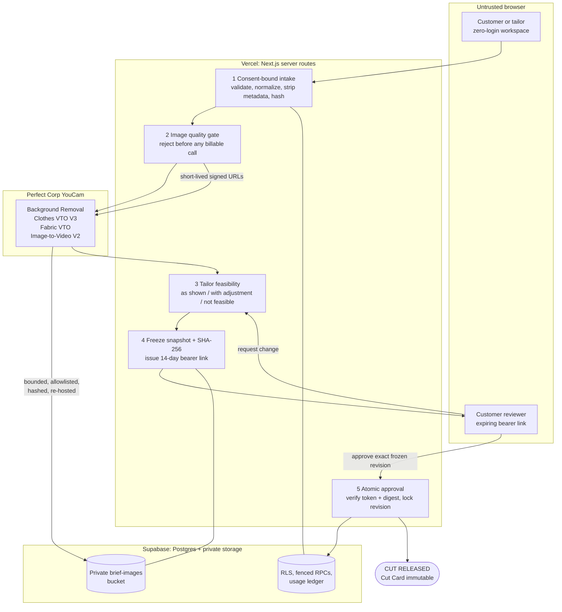

# PatternProof

**Most AI try-on helps you decide what to buy. PatternProof helps two people agree on what to
make, before fabric is cut.**

It turns a customer's garment inspiration into a tailor-feasibility-checked, customer-approved
**Cut Card**: a frozen, versioned visual agreement that both sides sign off on before an
irreversible cut.

Built for the YouCam API Skin AI & Apparel VTO Hackathon. **Apparel VTO track.**

---

## Judge it in 60 seconds

**No account, no email, no credential is required.** The live app is free to use and stays
available throughout the judging period.

| | |
|---|---|
| **Start here** | <https://patternproof-nu.vercel.app/create> |
| **Approved Cut Card (immutable)** | <https://patternproof-nu.vercel.app/s/demo-olive> |
| **Technical evidence ledger** | <https://patternproof-nu.vercel.app/proof> |

1. Open `/create` and walk the six visible stages: private intent, YouCam evidence, human veto,
   revision replay, consent to cut, and privacy exit.
2. The sample is deterministic and read-only, so it works even on a slow connection.
3. Choose **Create with my photos** at any point to open a separate, tenant-isolated anonymous
   workspace and run a real, consent-bound intake against the live YouCam API.

A longer step-by-step script is in [JUDGING.md](JUDGING.md).

---

## The problem

Virtual try-on exists to answer *"should I buy this finished garment?"* But in much of the
world, clothing is **made, not bought**.

India alone has around **12 million custom tailors**, one in six of all manufacturing workers,
**99% of them informal** and **72% of them women** ([Periodic Labour Force Survey 2023-24](https://www.dataforindia.com/the-rise-of-custom-tailoring/)).

The industry has been solving the wrong problem. Every made-to-measure tool improves
**measurement**, but Ashdown and DeLong found people detect a waist fit difference as small as
**0.5 cm** and vary significantly in what they accept ([Applied Ergonomics 1995, PMID 15677000](https://pubmed.ncbi.nlm.nih.gov/15677000/)).

> People can feel a half-centimetre difference, and they disagree about which half-centimetre is
> right. No tape measure resolves a disagreement about preference.

Off the rack, a mistake is a return. Made to order, a mistake is destroyed fabric. In much of
South Asia and West Africa the customer buys the cloth separately and brings it in, so a bad cut
destroys something already paid for. For the tailor, a remake is unpaid labour.

---

## YouCam APIs used

Four features, chained with exact server-derived unit accounting.

| Feature | Role | Cost | Boundary |
|---|---|---:|---|
| **Background Removal** | Optional rescue for a noisy garment reference | 1 unit | Before core preview; original and rescued hashes keep separate provenance |
| **Clothes VTO V3** | Required body-specific visual evidence | 2 units | Privately re-hosted; becomes the visual key in the frozen agreement |
| **Fabric VTO** | Optional provider-defined visual direction | 2 units | Before human review only; **never** claims uploaded-swatch fidelity or drape |
| **Image-to-Video V2** | Optional post-approval presentation proof | 5 units | After approval only; never enters or changes the construction checksum |

A full four-feature chain is exactly **10 units**. Costs were read from the authenticated
`GET /s2s/v2.0/credit/feature-cost` endpoint, not estimated. Every call is server-side,
idempotently admitted, bounded by a global circuit breaker, and never automatically retried
after an ambiguous vendor POST.

Live validation evidence, including latency and failure cases, is in
[D1-RESULTS.md](D1-RESULTS.md).

---

## How it works



**The three-key interlock.** Cutting is released only when YouCam visual evidence, the tailor's
construction judgment, and the customer's approval all point at the **same frozen revision**. A
`not_feasible` decision blocks customer review entirely. A change request preserves the previous
version and creates a new revision rather than rewriting history.

Browsers are untrusted and never receive the YouCam key or the Supabase service-role key.
Customer review links are unguessable expiring bearer links, and only their SHA-256 hashes are
stored. See [SECURITY.md](SECURITY.md) for the full integrity model.

---

## What this does not claim

Every render carries this label in the product:

> Visual intent reference. Not a guarantee of exact fit, measurements, construction, fabric
> behavior, or final appearance.

- **No uploaded-swatch fidelity.** Fabric VTO takes a provider-defined direction, not a customer
  swatch. We removed that claim rather than imply it.
- **No customer outcome data.** No pilot has run. [VALIDATION-PROTOCOL.md](VALIDATION-PROTOCOL.md)
  pre-declares what we would measure. There are no invented testimonials or personas anywhere.
- **Bounded problem research.** [RESEARCH.md](RESEARCH.md) documents 108 manually screened public
  tailoring complaints across 41 de-identified businesses and three cities. It is a purposive
  negative-review study, not a prevalence estimate, and it names the failure categories
  PatternProof does **not** solve.
- **Not a medical, legal, or fitting service.** The approval is an auditable shared visual brief,
  not a legal contract.

---

## Run it locally

Requires **Node.js 22** and **npm 10** or later.

```bash
cp .env.example .env.local   # then fill in the values
npm ci
npm run dev
```

Open <http://localhost:3000>. The Cut Card entry is at `/create`; the deterministic sample record
is at `/s/demo-olive`.

Live intake requires Supabase configuration including anonymous sign-ins. Full setup, migration
order, and deployment steps are in [OPERATIONS.md](OPERATIONS.md).

> On Windows, the parent workspace path contains `&`, so use the npm scripts rather than wrapping
> the path in an unquoted shell string.

### Quality checks

```bash
npm run check    # TypeScript, unit tests, ESLint
npm run build
npm audit --audit-level=low
```

Current status: **150/150 automated tests**, TypeScript, ESLint, an optimized 20-page production
build, and a Chrome navigation audit at 1440x1000 and 390x844 with zero console errors and zero
horizontal overflow.

---

## Documentation

| File | Contents |
|---|---|
| [JUDGING.md](JUDGING.md) | Step-by-step judge walkthrough |
| [D1-RESULTS.md](D1-RESULTS.md) | Live YouCam validation record: auth, latency, unit cost, failures |
| [RESEARCH.md](RESEARCH.md) | Bounded formative problem research and its limitations |
| [SECURITY.md](SECURITY.md) | Integrity model, trust boundaries, incident response |
| [OPERATIONS.md](OPERATIONS.md) | Environment, migrations, deployment, runbook, acceptance |
| [RELEASE-ACCEPTANCE.md](RELEASE-ACCEPTANCE.md) | Completed production acceptance matrix |
| [VALIDATION-PROTOCOL.md](VALIDATION-PROTOCOL.md) | Pre-declared pilot measurement plan |
| [ASSETS.md](ASSETS.md) | Provenance and rights for every demo asset |

All demo imagery is rights-cleared and documented. Screenshots are in
[submission/screenshots/](submission/screenshots/).

## Privacy

The user-facing notice is at `/privacy` and is linked from every page. Body photos live in a
private bucket, are served only through signed URLs, and can be permanently erased after
approval while the frozen agreement evidence is retained as integrity proof.

## Licence

MIT. See [LICENSE](LICENSE).
